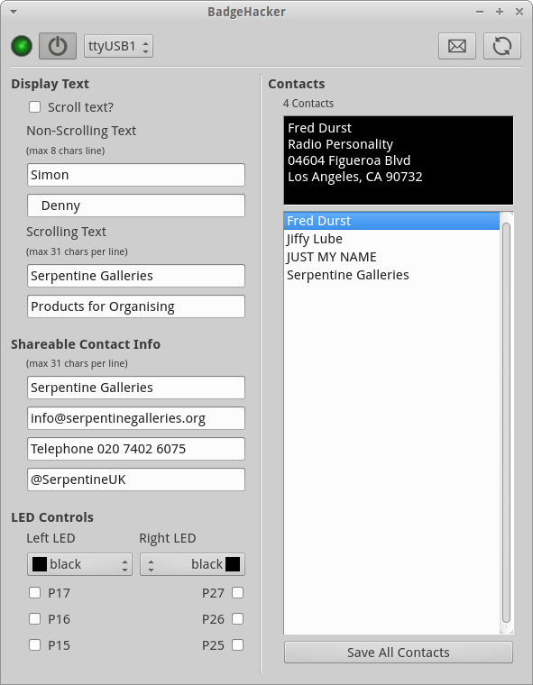
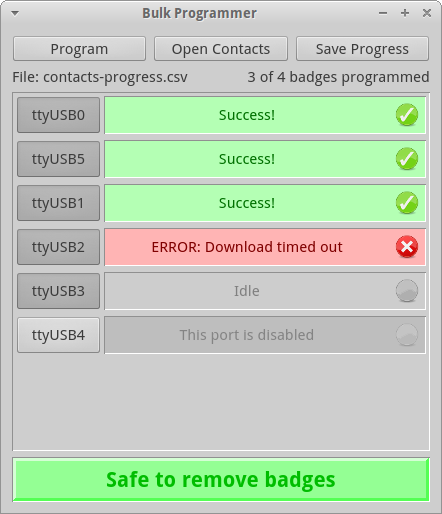

# BadgeHacker

BadgeHacker is a powerful set of tools to streamline the deployment of
Parallax Hackable Electronic Badges for your next event.

## Configurator Tool

The primary use of BadgeHacker allows guests to easily modify and retrieve
contacts from their badges, without having to touch a line of code.

## Bulk Programmer

BadgeHacker includes a powerful parallel loader that allows
event coordinators to make short work of badge programming. Use a spreadsheet
program to create your complete event guest list, then use the Bulk Programmer
to easily load individual contacts onto each badge.

Connect and program many badges at once and be done in a fraction of the time!

